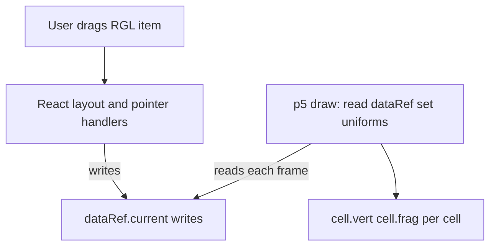

# Build plan: draggable grid + p5 light shader

Source product spec: [docs/instructions.md](../../docs/instructions.md) (if `docs/` is not gitignored). **Implementation** must follow the project’s [`.cursor/rules/shader-tut.mdc`](../rules/shader-tut.mdc) (always-apply) and [`.cursor/skills/p5-webgl-prototype/SKILL.md`](../skills/p5-webgl-prototype/SKILL.md) (React + p5 instance mode, ref bridge, cleanup, pointer to WebGL).

## Rules and skills (summary)

- **One p5 instance**, **instance mode** only: `new p5((p) => { ... }, hostElement)` — all APIs on `p`; do not use global `setup` / `draw`.
- **Mount** the instance in **`useEffect`** with a **container ref**; **stable dependency array** (not pointer, drag, or per-frame time). Stacked canvases come from re-running `new p5` without `p.remove()` or from constructing p5 in the **render** path — not from React re-renders alone.
- **Cleanup:** effect return must call **`p.remove()`** (unmount, Strict Mode in dev, Vite HMR).
- **Ref bridge:** *Mirror what the sketch needs into `useRef` (e.g. `dataRef.current`);* **`p.draw` reads the ref** for uniforms — **not** `setState` on every `pointermove` or every frame. **`useState`** for UI that must re-render; layout/pointer code **writes** `dataRef.current` (and optionally syncs controlled UI into the same ref in `useEffect` if needed).
- **Resize:** prefer **`p.resizeCanvas`** (e.g. from **`ResizeObserver`**) and updating `uResolution` / rects; **recreate** `new p5` only when truly necessary.
- **Grid / pointer:** React (or RGL) owns hit-testing; **no** p5 picking in the hot path.

## Recommendations (before / during code)

- **Doc build order (instructions lines 60–63):** (1) fixed 4×4 + light/shader, (2) `react-grid-layout` drag, (3) dynamic grid sizing.
- **TypeScript:** use `.tsx` / `.ts` (not the spec’s `App.jsx`); typed `dataRef` and cell rects.
- **Single coordinate system:** `uLightPos`, `uCellRect`, `uResolution` in the **same** space; default: **container top-left = (0,0)**; document one line in the shader bridge.
- **Stacking:** p5 `position: absolute; inset: 0;` under the grid; **canvas** `pointer-events: none` so RGL/drag gets events.
- **Do not** add `react-p5` / `react-p5-wrapper` unless you have verified they match the above lifecycle; raw p5 in `useEffect` matches the skill.

## Architecture

- **p5** (WEBGL): one `draw` loop, **per-cell** pass as in the spec: set shader, uniforms for that `uCellRect`, draw full quad/rect.
- **React** does not re-render from inside `draw()`.

## Phase 1 — Static 4×4, light + shader (no RGL)

**Goal:** `dataRef` → instance-mode p5 → visible light from fixed `uLightPos` (e.g. top-left).

- Layout in [src/App.css](../../src/App.css) / [src/App.tsx](../../src/App.tsx): `position: relative` stack; p5 host `absolute; inset: 0`, **4×4 CSS grid** overlay; stable size via `min-h` / full width and **ResizeObserver** driving canvas + `uResolution`.
- [src/components/ShaderCanvas.tsx](../../src/components/ShaderCanvas.tsx): `useRef<HTMLDivElement>`, **only** in `useEffect` → `new p5(sketch, node)`; sketch in [src/sketches/gridShader.ts](../../src/sketches/gridShader.ts) as **instance mode** `(p) => { p.setup; p.draw = ... }`. **Vite** raw GLSL: [src/shaders/cell.vert](../../src/shaders/cell.vert), [src/shaders/cell.frag](../../src/shaders/cell.frag) with `?raw`.
- **Typed** `dataRef.current`: e.g. `{ lightPos, cellRects[], time? }` — phase 1 may **hardcode** 16 rects in pixel space from container size.
- **Fragment shader:** diffuse + distance falloff from fragment position vs `uLightPos` (extend later).
- **No** `react-grid-layout` in package.json until phase 2.

## Phase 2 — react-grid-layout for drag

- Add `react-grid-layout` (+ types if not bundled).
- 4×4, items `1×1` in grid units; **convert** `width` × `rowHeight` × `margin` × `cols` + layout to **pixel rects** in container space; **write** into `dataRef` in `onLayout` / `onDragStop` / `useLayoutEffect` — **avoid** `setState` for each frame of drag for values only the shader needs.
- **Light:** fixed at container (0,0) unless a separate UI moves it (state → ref sync).

## Phase 3 — Dynamic grid (optional)

- Configurable `rows` / `cols`, regenerate layout and `cellRects`; on container size change, prefer **resizeCanvas**; remount p5 only if unavoidable.

## File layout (TS)

| Area | Path |
|------|------|
| App + shared `dataRef` | [src/App.tsx](../../src/App.tsx) |
| RGL + drag | `src/components/DraggableGrid.tsx` |
| p5 mount | `src/components/ShaderCanvas.tsx` |
| Instance-mode sketch | `src/sketches/gridShader.ts` |
| GLSL | `src/shaders/cell.vert`, `src/shaders/cell.frag` |

## Risks and edge cases

- **p5 WEBGL Y** vs screen top-left: align `uCellRect` and draws with a small, tested mapping.
- **DPR:** `pixelDensity(1)` or consistent handling in `uResolution` and rects.
- **Wrong `useEffect` deps** including pointer/animation: recreates p5 and stacks canvases — keep deps **stable**; only ref writes from handlers.

## Note on docs and git

If [`.gitignore`](../../.gitignore) still lists `docs/`, [docs/instructions.md](../../docs/instructions.md) is not committed; remove the ignore or duplicate the spec in a tracked file if the team needs it in the remote.
